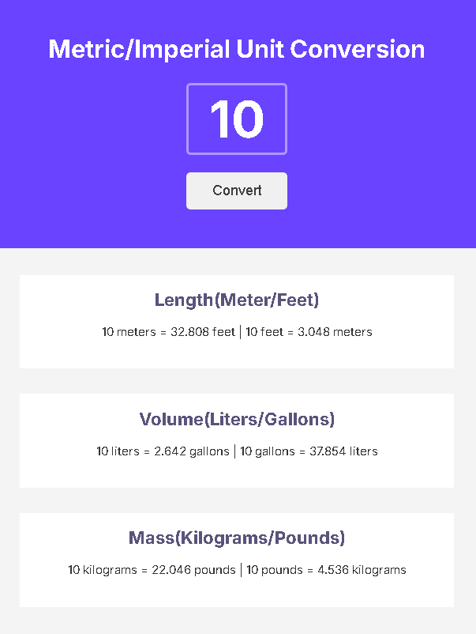

# 🔄 Unit Converter

A simple metric/imperial unit converter built with **HTML**, **CSS**, and **JavaScript** as part of the Scrimba Frontend Developer Career Path.

## 📷 Preview



## 🚀 Features

- Convert between meters and feet.
- Convert between liters and gallons.
- Convert between kilograms and pounds.
- Display conversion results rounded to three decimal places.
- Handle decimal input values.
- Validate empty input before performing conversions.

## 🛠️ Technologies

- HTML5
- CSS3
- JavaScript (Vanilla)
- Vite

## 🎯 Learning Goals

This project was created to practice:

- DOM manipulation
- Event handling
- Functions and code reuse
- Template literals
- Number formatting
- Input validation
- CSS Flexbox

## ▶️ Live Demo

[View Live Demo](https://unit-converter-sm.netlify.app/)

## 📂 Installation

Clone the repository:

```bash
git clone https://github.com/sanleomon/unit-converter.git
```

Open the project folder:

```bash
cd unit-converter
```

Install the dependencies:

```bash
npm install
```

Run the development server:

```bash
npm run dev
```

## 📚 About

This project was built as part of the **Scrimba Frontend Developer Career Path**.

The user interface was recreated from a provided Figma design, and the unit conversion functionality was implemented using vanilla JavaScript.